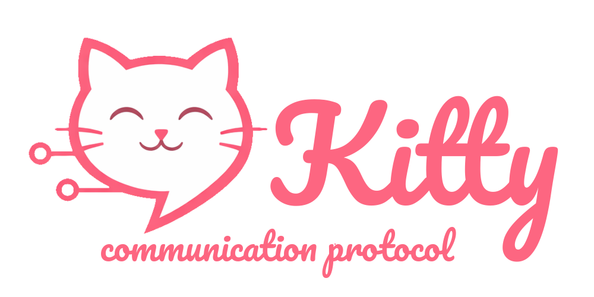

 [🇵🇱 Wersja polska](README.pl.md) | 🇬🇧 *English version*

 # Kitty Protocol

 ## Project Overview

 Kitty Protocol is a custom, lightweight communication protocol designed to ensure maximum privacy and high‑speed exchange of short text messages.  
 The project is based on a Client‑Server architecture, where the central server (Hub) acts only as a router and has no access to message content.

 ### Key Features:
 * **`End‑to‑End Encryption (E2EE)`**: Full encryption performed exclusively on the client side; the server stores no keys or message history.
 * **`Powered by QUIC`**: The protocol is built on the QUIC transport layer, ensuring low latency (0‑RTT) and stable connections during network changes (e.g., switching from Wi‑Fi to LTE).
 * **`JSON Format`**: Data is transmitted in a readable JSON text format, simplifying debugging and protocol development.
 * **`Attack Resistance`**: Native support for TLS 1.3 and mechanisms preventing Man‑in‑the‑Middle (MitM) and Replay attacks.

 ### Documentation:
 Full protocol documentation is available here: [KittyProtocol.pdf](docs/KittyProtocol-EN.pdf)

 ---
 Authors: 
 
 [Gabriela Błaut](https://github.com/gabbla05), 

 [Michał Brzeziński](https://github.com/Michal-Brzezinski), 

 [Aleksandra Gołek](https://github.com/styliana)  
